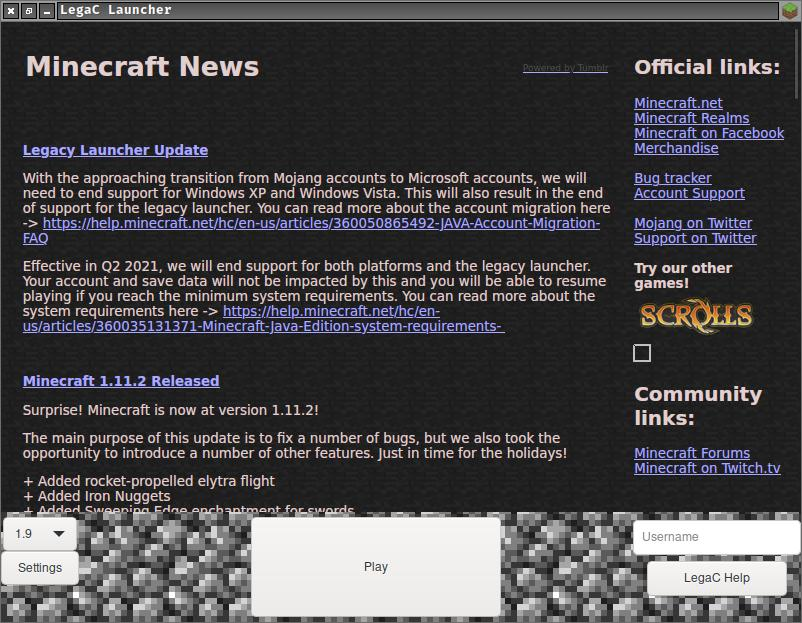

LegaC Launcher
===============

A Minecraft launcher made with GTK and Curl in pure C.

The main goal is to provide the old looking style of the Minecraft launcher,
while maintaining new features that modern launchers have.

Usage
-----

To install it is really simple. Clone, enter, make, run, rage.
```shell
git clone https://gitlab.com/SimplyCEO/LegaC-Launcher.git
cd LegaC-Launcher
make BUILD_TYPE=Release
mkdir -p "${HOME}/.local/share/legac_launcher" && cp -r ./assets "${HOME}/.local/share/legac_launcher"
bin/legac_launcher
```
Or just open `legac_launcher` located inside `bin` folder.

To avoid overwritting your `CFLAGS` use `make BUILD_TYPE=Custom`.

At the moment it is not recommended to install on system. Just run locally until the stable version comes out.

TODO
----

There are nothing much dynamic at this point, since the launcher was tested
for a specific version.

Why? Because it took me almost an entire week to understand how all of this works.

The initial code given here works as intended, but not how it should be... there
WILL be more work to do.

This is the first open source Minecraft launcher available in C.
And hopefully, at the end of the development version, occur a stable in ANSI C.

Gallery
-------

<p align="left">
  
</p>

